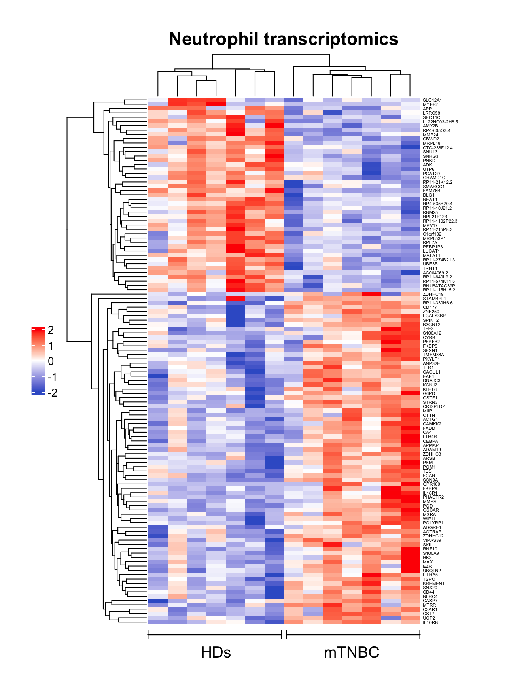
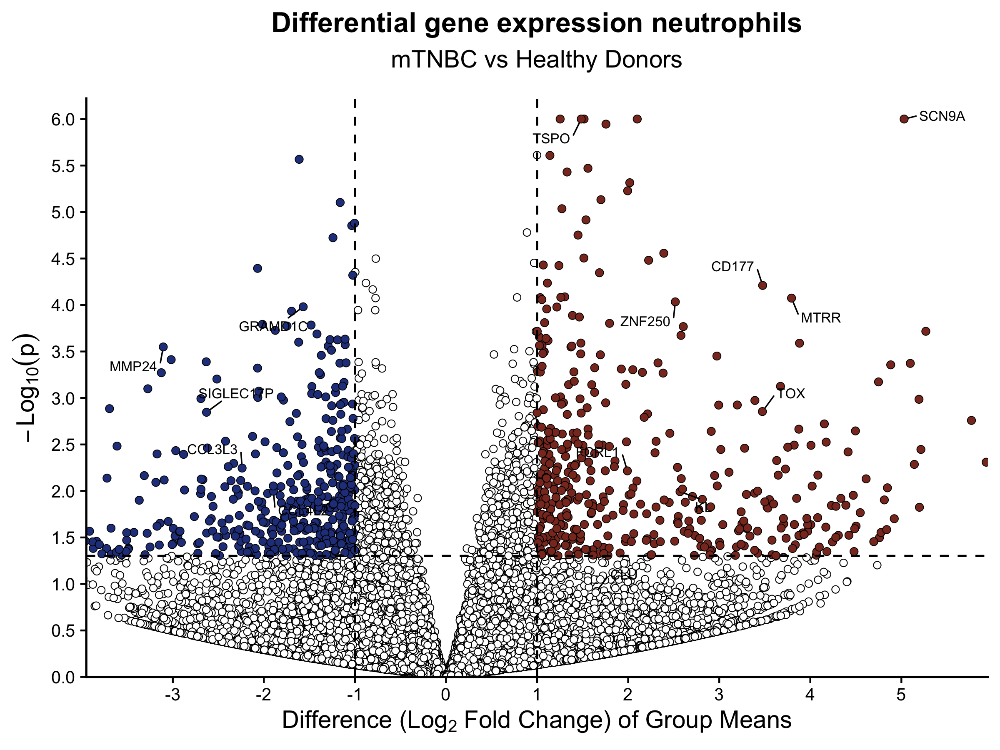

GSE264108 Neutrophil Bulk RNA-seq Reanalysis

mTNBC vs Healthy Donors

  
  
  

A reproducible, open-source reanalysis of GSE264108 that approximates the differential-expression workflow and transcriptomic visualizations reported in the original study.

Overview

This repository reanalyzes the publicly available neutrophil bulk RNA-seq data from GSE264108 and generates open-source approximations of the heatmap and volcano plot associated with Figure 5 of:

Bakker NAM, Garner H, van Dyk E, et al.
Triple-negative breast cancer modifies the systemic immune landscape and alters neutrophil functionality.
npj Breast Cancer. 2025;11:5.
https://doi.org/10.1038/s41523-025-00721-2

The analysis compares peripheral-blood neutrophils from:

7 patients with metastatic triple-negative breast cancer (mTNBC)

7 healthy donors (HDs)

The statistical analysis is performed with DESeq2 using the public GEO count matrix. The heatmap and volcano plot are recreated with open-source R packages and are intended to be publication-guided approximations rather than exact replicas of the original Qlucore figures.

Results summary

Metric

Result

Samples

14

Healthy donors

7

mTNBC

7

Genes in raw count matrix

23,567

Significant DEGs

122

Upregulated in mTNBC

77

Downregulated in mTNBC

45

Significance threshold

padj < 0.05

The original paper reports 127 DEGs (90 upregulated and 37 downregulated).
This workflow identifies 122 DEGs (77 upregulated and 45 downregulated) from the deposited count matrix.

Approximate reconstruction of Figure 5

<table>
<tr>
<td width="50%" align="center">

<strong>Figure 5a. Neutrophil transcriptomics heatmap</strong>

</td>
<td width="50%" align="center">

<strong>Figure 5b. Differential gene-expression volcano plot</strong>

</td>
</tr>
</table>

These panels are approximate reconstructions based on the public data and methods reported in the paper. They are not expected to be pixel-for-pixel identical to the published figures because the exact internal Qlucore visualization settings were not fully reported.

Analysis workflow

flowchart LR
    A["GEO GSE264108"] --> B["Raw counts"]
    B --> C["DESeq2"]
    C --> D["Significant genes padj < 0.05"]
    D --> E["DEG tables"]
    D --> F["Volcano plot"]

    A --> G["Normalized counts"]
    G --> H["Significant genes"]
    H --> I["Row Z-score"]
    I --> J["Hierarchical clustering"]
    J --> K["Heatmap"]

Methods

Differential expression

DESeq2 is run on the raw gene-count matrix.

Comparison:

mTNBC vs Healthy

Interpretation:

positive log2 fold change  = higher expression in mTNBC
negative log2 fold change  = higher expression in Healthy donors

Significant genes are defined as:

padj < 0.05

Heatmap

The heatmap uses:

genes significant by DESeq2

the GEO-deposited normalized count matrix

row-wise Z-score scaling

Euclidean distance

average-linkage hierarchical clustering

ComplexHeatmap for visualization

The original study used Qlucore Omics Explorer 3.8 for visualization. The exact Qlucore workflow is not fully available, so this heatmap should be interpreted as an open-source approximation of the published panel.

Volcano plot

The volcano plot displays:

x-axis = log2 fold change
y-axis = -log10(raw p-value)

Visual thresholds:

p < 0.05
|log2FC| > 1

The labeled genes correspond to those shown in the published Figure 5b and are used for visualization only. Statistical significance remains defined by padj < 0.05.

Original paper vs this repository

Component

Original paper

This repository

Differential expression

DESeq2

DESeq2

Reported R version

R 4.1.0

Recorded in renv.lock and sessionInfo.txt

RNA-seq visualization

Qlucore 3.8

ComplexHeatmap and ggplot2

Heatmap input

Exact Qlucore workflow not fully reported

GEO normalized count matrix

Clustering

Qlucore

Euclidean distance + average linkage

DEG count

127

122

Up / Down

90 / 37

77 / 45

Volcano labels

Selected genes shown by authors

Same labels used for visual comparison

This project is best described as a reproducible reanalysis with publication-guided visualization, rather than an exact reproduction of the authors' original computational workflow.

Run the analysis

1. Clone the repository

git clone https://github.com/SubediG/Bulk-Cell-RNA-seq-Analysis.git
cd Bulk-Cell-RNA-seq-Analysis

2. Install R

Install R from:

https://cran.r-project.org/

RStudio is optional:

https://posit.co/download/rstudio-desktop/

3. Restore the project environment

Start R from the repository folder:

R

Then run:

install.packages("renv")
renv::restore()
renv::status()

A correctly restored environment should report:

No issues found -- the project is in a consistent state.

4. Run the analysis

From the repository root:

Rscript DESeq2_mTNBC_Analysis.R

The GEO files are downloaded automatically and the outputs are written to:

results/

RStudio option

Open:

Bulk-Cell-RNA-seq-Analysis.Rproj

Then run:

install.packages("renv")
renv::restore()
source("DESeq2_mTNBC_Analysis.R")

Output files

results/
├── DESeq2_results.csv
├── DESeq2_significant_genes.csv
├── top10_upregulated_genes.csv
├── top10_downregulated_genes.csv
├── Figure5a_heatmap.png
├── Figure5a_heatmap.pdf
├── Figure5b_volcano.png
├── Figure5b_volcano.pdf
└── sessionInfo.txt

Reproducibility

The repository uses:

automatic GEO data retrieval

relative file paths

renv.lock for package versions

explicit sample-count checks

explicit statistical thresholds

sessionInfo.txt for software documentation

No Docker, Conda, Qlucore, or manual data download is required.

Citation

Original study

Bakker NAM, Garner H, van Dyk E, et al.
Triple-negative breast cancer modifies the systemic immune landscape and alters neutrophil functionality.
npj Breast Cancer. 2025;11:5.
https://doi.org/10.1038/s41523-025-00721-2

Links

Original article

PubMed

Author information

GEO accession GSE264108

Disclaimer

This is an independent reproducibility project based on publicly available data. It is not the original authors' analysis repository, does not claim exact reproduction of the published visualizations, and is not intended for clinical use.