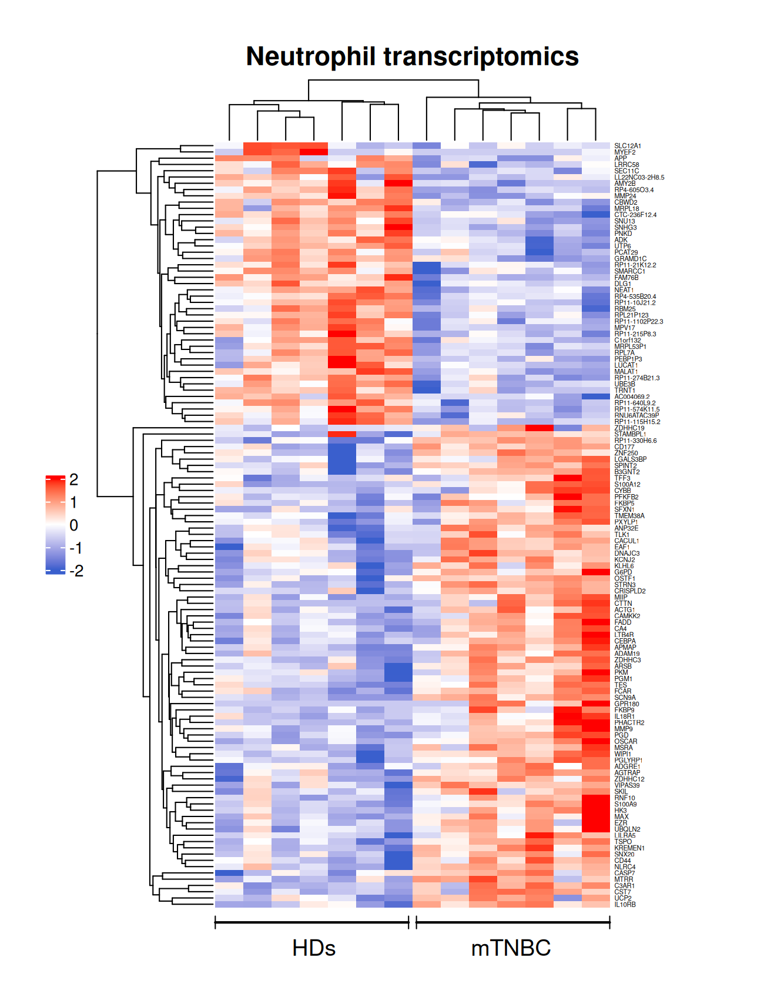
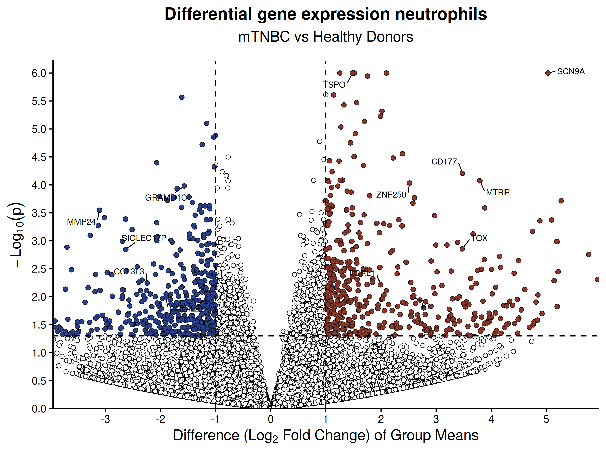
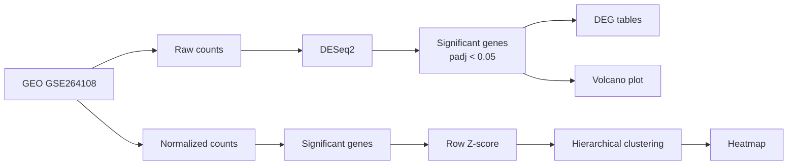

<a id="readme-top"></a>

<div align="center">

# Transcriptomic Reanalysis of Circulating Neutrophils in Metastatic Triple-Negative Breast Cancer for repr

### Reproducible analysis of GSE264108 and publication-guided reconstruction of transcriptomic results

A reproducible bulk RNA-seq reanalysis comparing circulating neutrophils from
**metastatic triple-negative breast cancer (mTNBC)** patients and **healthy donors** to generate fig5a and fig5b of the original paper.

<p align="center">

  <a href="https://www.nature.com/articles/s41523-025-00721-2">
    
  </a>

  <a href="https://www.ncbi.nlm.nih.gov/geo/query/acc.cgi?acc=GSE264108">
    
  </a>

  <a href="https://pubmed.ncbi.nlm.nih.gov/39843922/">
    
  </a>

</p>

</div>

---

<details>
  <summary><strong>Table of Contents</strong></summary>

  <ol>
    <li><a href="#about-the-project">About the Project</a></li>
    <li><a href="#results">Results</a></li>
    <li><a href="#built-with">Built With</a></li>
    <li><a href="#getting-started">Getting Started</a></li>
    <li><a href="#usage">Usage</a></li>
    <li><a href="#differences-from-the-original-paper">Differences from the Original Paper</a></li>
    <li><a href="#output">Output</a></li>
    <li><a href="#citation">Citation</a></li>
    <li><a href="#acknowledgments">Acknowledgments</a></li>
  </ol>

</details>

---

<a id="about-the-project"></a>


This project reanalyzes the publicly available neutrophil bulk RNA-seq dataset **GSE264108** from the study:

> *Triple-negative breast cancer modifies the systemic immune landscape and alters neutrophil functionality.*  
> **npj Breast Cancer. 2025;11:5.**  
> https://doi.org/10.1038/s41523-025-00721-2

The dataset contains peripheral-blood neutrophils from:

- **7 patients with metastatic triple-negative breast cancer (mTNBC)**
- **7 healthy donors (HDs)**

The goal of this repository is to provide a transparent and reproducible reanalysis of the public count data and to generate **publication-guided approximations** of the transcriptomic heatmap and volcano plot shown in Figure 5.

The figures are not intended to be exact replicas of the original Qlucore output.

<p align="right">(<a href="#readme-top">back to top</a>)</p>

---

<a id="results"></a>


| Metric | Result |
|---|---:|
| Samples | 14 |
| Healthy donors | 7 |
| mTNBC | 7 |
| Genes in raw count matrix | 23,567 |
| Significant DEGs | **122** |
| Upregulated in mTNBC | **77** |
| Downregulated in mTNBC | **45** |
| Significance threshold | `padj < 0.05` |

The original paper reports **127 differentially expressed genes (90 upregulated and 37 downregulated)**.

This workflow identifies **122 differentially expressed genes (77 upregulated and 45 downregulated)** from the deposited raw count matrix.

### Approximate reconstruction of Figure 5

<table>
<tr>

<td width="50%" align="center">

<strong>Figure 5a. Neutrophil transcriptomics</strong>



</td>

<td width="50%" align="center">

<strong>Figure 5b. Differential gene expression</strong>



</td>

</tr>
</table>

<p align="right">(<a href="#readme-top">back to top</a>)</p>

---

<a id="built-with"></a>


The analysis is implemented in **R** and can be reproduced in a containerized environment using **Docker**.

- **DESeq2** — differential-expression analysis
- **ComplexHeatmap** — heatmap visualization
- **ggplot2** — volcano plot visualization
- **ggrepel** — gene-label placement
- **circlize** — heatmap color mapping
- **renv** — reproducible R package environment
- **Docker** — reproducible R, Bioconductor, and system environment

The Docker environment uses:

- **R 4.5.2**
- **Bioconductor 3.22**
- package versions recorded in `renv.lock`

The original publication used **DESeq2** for differential-expression analysis and **Qlucore Omics Explorer 3.8** for RNA-seq visualization.

<p align="right">(<a href="#readme-top">back to top</a>)</p>

---

<a id="getting-started"></a>


The recommended way to reproduce this analysis is with **Docker**.

Docker provides the required R, Bioconductor, and package environment inside an isolated container. This means that you do **not** need to install R, Bioconductor, DESeq2, or the other R packages on your computer.

### Prerequisites

You need:

- [Git](https://git-scm.com/downloads)
- [Docker Desktop](https://www.docker.com/products/docker-desktop/)

Docker Desktop installation instructions are available for each operating system in above link.

### Install and start Docker Desktop

1. Download the appropriate Docker Desktop installer for your operating system.
2. Install Docker Desktop.
3. Open **Docker Desktop**.
4. Complete the initial setup using the recommended settings.
5. Wait until Docker Desktop indicates that the Docker engine is running.
6. Open a new Terminal, PowerShell, or command-line window.

A Docker account is not required to run this analysis locally.

Verify that Docker Compose is available:

```bash
docker compose version
```

You should see a Docker Compose version.

If the command is not recognized immediately after installation, close and reopen your terminal and make sure Docker Desktop is running.

### Run the analysis

1. Clone this repository:

```bash
git clone https://github.com/SubediG/Bulk-Cell-RNA-seq-Analysis.git
cd Bulk-Cell-RNA-seq-Analysis
```

2. Build the reproducible Docker environment and run the analysis:

```bash
docker compose up --build
```

That is all that is required.

During the first run, Docker will:

```text
Build the R 4.5.2 / Bioconductor 3.22 environment
        ↓
Restore the recorded R package environment
        ↓
Download the required GSE264108 files from GEO
        ↓
Run the DESeq2 differential-expression analysis
        ↓
Generate the heatmap and volcano plot
        ↓
Save newly generated outputs in results/
```

The first Docker build may take several minutes because the required software environment must be downloaded and created. Subsequent runs are generally faster because Docker can reuse previously downloaded components.

A successful analysis should report:

```text
Significant genes: 122
Upregulated: 77
Downregulated: 45

Analysis complete.
```

Newly generated files will appear in:

```text
results/
```

The repository also contains:

```text
reference_results/
```

which stores the reference outputs generated for this project.

This allows users to independently regenerate the analysis and compare their output with the reference results.

### Alternative: R + renv

Users who prefer to run the analysis directly in R can use **R 4.5.2** and restore the included `renv` environment.

Start R from the repository directory:

```bash
R
```

Restore the environment:

```r
renv::restore()
```

Confirm that the environment is synchronized:

```r
renv::status()
```

A correctly restored project should report:

```text
No issues found -- the project is in a consistent state.
```

Run the analysis:

```r
source("DESeq2_mTNBC_Analysis.R")
```

Docker is recommended when the goal is reproducibility across different computers and local R installations.

<p align="right">(<a href="#readme-top">back to top</a>)</p>

---

<a id="usage"></a>


The workflow performs the following steps:



### Differential expression

DESeq2 is run using the **raw count matrix**.

```text
mTNBC vs Healthy
```

Interpretation:

```text
positive log2 fold change  = higher expression in mTNBC
negative log2 fold change  = higher expression in Healthy donors
```

Significant genes are defined as:

```text
padj < 0.05
```

### Heatmap

The heatmap uses:

- DESeq2-significant genes
- the GEO-deposited normalized count matrix
- row-wise Z-score scaling
- Euclidean distance
- average-linkage hierarchical clustering

### Volcano plot

The volcano plot displays:

```text
x-axis = log2 fold change
y-axis = -log10(raw p-value)
```

Visual thresholds:

```text
p < 0.05
|log2FC| > 1
```

The labeled genes correspond to genes highlighted in the published Figure 5b and are used for visual comparison only.

<p align="right">(<a href="#readme-top">back to top</a>)</p>

---

<a id="differences-from-the-original-paper"></a>


This repository is a **reproducible reanalysis with publication-guided visualization**, not an exact reconstruction of the authors' original computational workflow.

| Component | Original paper | This repository |
|---|---|---|
| Dataset | GSE264108 | GSE264108 |
| Comparison | mTNBC vs Healthy donors | mTNBC vs Healthy donors |
| Differential expression | DESeq2 | DESeq2 |
| Reported R version | R 4.1.0 | R 4.5.2 in Docker |
| Package environment | Not fully specified | Recorded in `renv.lock` |
| Visualization | Qlucore 3.8 | ComplexHeatmap + ggplot2 |
| Heatmap input | Exact Qlucore workflow not fully reported | GEO normalized count matrix |
| Clustering | Qlucore | Euclidean distance + average linkage |
| DEG count | **127** | **122** |
| Up / Down | **90 / 37** | **77 / 45** |
| Volcano labels | Selected genes shown by authors | Same genes labeled for visual comparison |

Differences in DEG counts and figure geometry are preserved transparently rather than adjusting thresholds or preprocessing to force an exact match.

<p align="right">(<a href="#readme-top">back to top</a>)</p>

---

<a id="output"></a>


Newly generated files are written to:

```text
results/
```

Expected output:

```text
results/
├── DESeq2_results.csv
├── DESeq2_significant_genes.csv
├── top10_upregulated_genes.csv
├── top10_downregulated_genes.csv
├── Figure5a_heatmap.png
├── Figure5a_heatmap.pdf
├── Figure5b_volcano.png
├── Figure5b_volcano.pdf
└── sessionInfo.txt
```

The repository also contains:

```text
reference_results/
```

These files are the reference outputs generated during development of this reproducibility project.

They allow users to distinguish between:

```text
reference_results/  = expected reference outputs
results/            = newly generated outputs
```

### Repository structure

```text
Bulk-Cell-RNA-seq-Analysis/
├── DESeq2_mTNBC_Analysis.R
├── Bulk-Cell-RNA-seq-Analysis.Rproj
├── README.md
├── Dockerfile
├── compose.yaml
├── .dockerignore
├── .gitignore
├── .Rprofile
├── renv.lock
├── renv/
├── data/
├── results/
└── reference_results/
```

Directory roles:

```text
data/               → GEO input files downloaded automatically
results/            → outputs generated when the analysis is run
reference_results/  → reference outputs committed with this repository
```

The large GEO input files are not stored in the repository because the script downloads them automatically during the analysis.

<p align="right">(<a href="#readme-top">back to top</a>)</p>

---

<a id="citation"></a>


If you use this repository or adapt the workflow, please cite the original study and GEO dataset.

### Original study

**Bakker NAM, Garner H, van Dyk E, et al.**  
*Triple-negative breast cancer modifies the systemic immune landscape and alters neutrophil functionality.*  
**npj Breast Cancer. 2025;11:5.**

DOI: https://doi.org/10.1038/s41523-025-00721-2

- [Original article](https://www.nature.com/articles/s41523-025-00721-2)
- [PubMed](https://pubmed.ncbi.nlm.nih.gov/39843922/)
- [Author information](https://www.nature.com/articles/s41523-025-00721-2#author-information)
- [GEO accession GSE264108](https://www.ncbi.nlm.nih.gov/geo/query/acc.cgi?acc=GSE264108)

<p align="right">(<a href="#readme-top">back to top</a>)</p>

---

<a id="acknowledgments"></a>


All credit for the original study design, biological experiments, sequencing, dataset generation, and scientific conclusions belongs to the original authors.

This repository is an independent reproducibility project based on publicly available data and is not the authors' original analysis repository.

<p align="right">(<a href="#readme-top">back to top</a>)</p>
